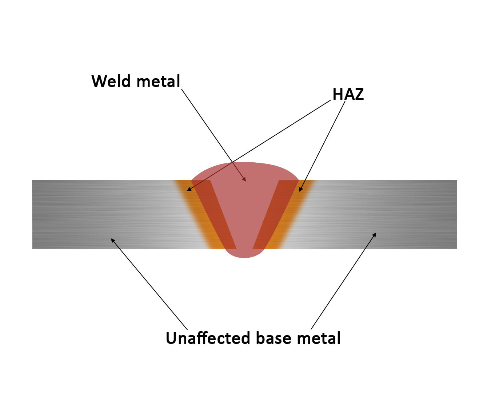
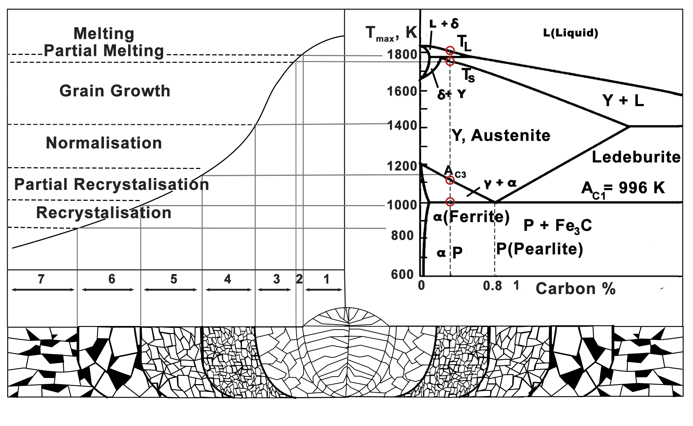

#  Introduction:

Microstructural evolution is very important during welding, the material will undergo different thermal cycles like intense heating and cooling that will lead to different zone formation in welded joints. Each zone will be subjected to different temperatures, and broadly divided into three different types of zones. Fusion zone, heat-affected zone, and unaffected base metal or parent metal. This zone can be observed by polishing and etching of the weld cross-section. In the fusion zone melting and solidification of the molten metal takes place. In the heat-affected zone, the microstructural changes from the parent metal with the absence of melting, and no microstructural changes occur in unaffected base metal or parent metal. Microstructural properties affect the mechanical properties of the welded joint after welding, such as tensile strength, toughness, and hardness.

# Theory:
## Weld zone:
On presence of an electric arc, the parent metals undergo melting which starts solidifying after the arc moves away. The zone that melts fully and undergoes solidification is known as the weld zone or the fusion zone.  It is obtained by the fusion of the parent metal with or without filler metal.   The microstructure of the weld zone will be drastically different from the parent metal and is mostly columnar in nature. The shape of the weld zone will be different depending on the type of welding process, number of weld pass, material properties and material thickness.
## Heat Affected Zone (HAZ):
As the name suggests this is a zone that is affected by the heat used for welding. It is the region that does not undergo melting and whose properties have changed due to exposure to relatively high temperatures during welding. Figure 1 shows the HAZ between the weld and unaffected parent metal.

#### Figure 1. Different zones in welding

The amount of heat entering the material affects the width of the HAZ, which is proportional to the welding process. The thermal diffusivity also affects the HAZ's size. Those materials with a high thermal diffusivity can transmit heat faster, which means that they cool more quickly for a given level of heat input, resulting in a smaller HAZ width. Copper's thermal diffusivity is substantially greater than steel. As a result, given the same heat input, the HAZ of copper would be narrower than steel. The HAZ can be identified with the alternate microstructure compared to the parent metal and the weld zone. 

The microstructure is mostly equiaxed and have smaller grain size with the size increasing for the region near the weld zone. 

A thin region of partially melted region lies between the HAZ and weld zone.

There also exists a partially transformed zone that is also termed as inter critical heat affected zone between the fine grained HAZ and the base metal. 
In case of materials having specific grain orientation for example rolled steel, the base metal may also go through some grain reorientation by tempering at 0.4 Tm (0.4 times melting temperature). This is also termed as subcritical Heat Affected Zone. However for parent materials in the annealed state does not go through this tempered zone. 

## Parent metal/ Base metal:
In welding, parent metal or base metal refers to the workpiece that has to be joined during welding. Parent metal plays a key role in welding as its characteristics and properties will decide the overall strength and integrity of the weld. The weldability of the parent metal depends on its chemical composition, mechanical properties, and material susceptibility to cracking or distortion during welding. Autogenous welding, or welding without filler material may be possible depending on the parent material property. When using additional filler material, one should choose filler material having compatibility of the parent material. The base metal remains unaffected by any heating operation during welding.

## Microstructural evolution in Weld metal:
During welding, various zones are subjected to distinct thermal cycles, in welded joints. Metal in the welding zone heats up faster and at a higher temperature than metal further away from the weld. Due to this, each zone will have different local mechanical and metallurgical properties. 
The following figure 2 shows the microstructure zones in low-carbon steel fusion welding.

#### Figure 2. Microstructure zones in low-carbon steel fusion welding

    
         

***Zone 1: Weld zone*** – Metal is heated above liquidus temperature, columnar grains form in the weld zone, and grains grow in a crystallographic direction of heat flow.

***Zone 2:  Partially Melted Zone*** - It is between the fusion and high-temperature HAZ. The base metal is partially melted in this zone.

***Zone 3: Grain growth Zone (High-temperature HAZ)***- Coarser grains will be formed due to the high temperature in this zone. Rapid austenitic grain growth occurs, and the coarser grains will have more hardenability and can transform into martensite by cooling.

***Zone 4: Grain refinement Zone (Low-temperature HAZ)***-Fine grain structure metal heated slightly above AC3. When heated above AC3, metal endures a complete transformation to an austenitic state, resulting in a region of complete recrystallization.

***Zone 5: Partial recrystallization***- In this zone (AC1 < Tmax < AC3), Pearlite colonies transform entirely or partially into austenite, whereas ferrite grains remain unchanged.  Pearlite is a mixture of cementite and ferrite.

***Zone 6: Recrystallisation*** - In this zone, the microstructure remains unchanged (Tmax< AC1) if the metal was annealed condition before welding. The recrystallization process will occur if metal was work hardened by bending or cold rolling. The minimum temperature required for recrystallization for pure metals is 0.4Tm, where Tm is the temperature required for melting in (K). In welded joints, area heated above 800K undergo recrystallization.

***Zone 7: Unaffected parent or base metal***- This zone has no microstructure changes.

***Zone 2-6 combine to form a single (HAZ)***. Partially melting zone and grain growth zone is crucial in low alloy steel. Microstructural properties will decide the strength of the welded joint after welding, such as sensitivity to solidification, liquation cracking, and different mechanical properties like strength, toughness, and hardness.

